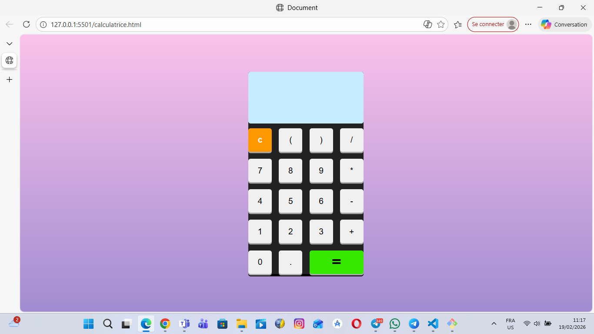

# Calculator

A simple web-based calculator built with **HTML, CSS, and JavaScript**.  
This project is designed to practice front-end development, interactive UI, and responsive design.

## Features

- Perform basic arithmetic operations (addition, subtraction, multiplication, division)
- Clean and responsive interface
- Works in any modern web browser

## Project Structure

- `index.html` – main HTML file
- `style.css` – styling for the calculator
- `script.js` – JavaScript logic for calculations

## How to Use

1. Clone or download the repository.
2. Open `index.html` in your web browser.
3. Click on the buttons to perform calculations.

## Objective

Improve front-end development skills and explore interactive web applications

## Preview

